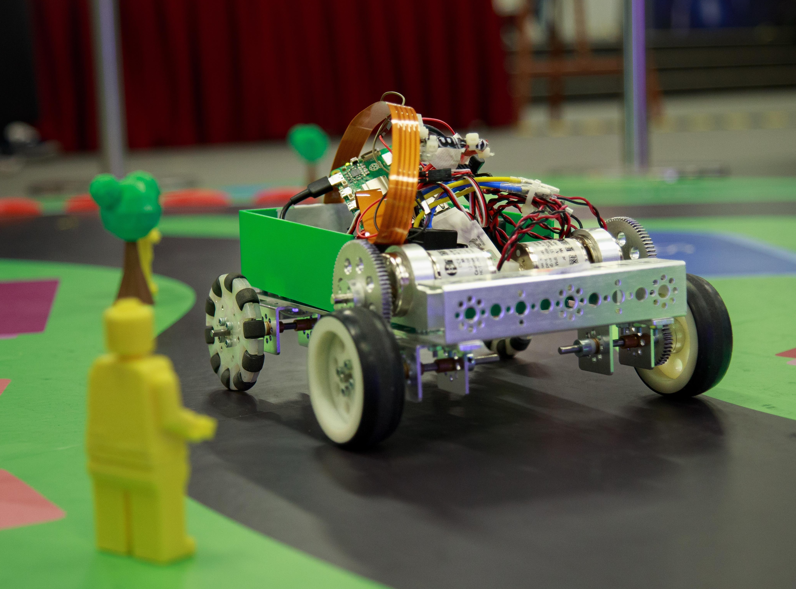

# Overflow Open House 2024: RC Car Project

> WebSocket-Controlled RTSP Video Streaming and Motor Control



This project provides a framework to control a robotic vehicle with video streaming capabilities using WebSocket communication. It includes features such as RTSP video streaming, motor control, and authentication for secure access.


## Demo
Watch it on [YouTube](https://www.youtube.com/watch?v=xpdiwNy15Jw).

## Features

- RTSP Video Streaming: Streams video using GStreamer and OpenCV.
- Motor Control: Controls motors through GPIO pins, enabling remote navigation.
- WebSocket Communication: Facilitates real-time control and data exchange.
- Secure Access: Password-protected access to ensure authorized usage.

## Setup and Installation

### Prerequisites

1. **Python**: Ensure Python 3.x is installed.
2. **System Dependencies**: Install the required libraries and dependencies using the following command:

```bash
sudo apt install python3-dev python3-gi python3-gi-cairo gir1.2-gtk-4.0 libcairo2-dev libgirepository1.0-dev libgstreamer1.0-0 gstreamer1.0-plugins-base gstreamer1.0-plugins-good gstreamer1.0-plugins-bad gstreamer1.0-plugins-ugly gstreamer1.0-libav gstreamer1.0-tools gstreamer1.0-x gstreamer1.0-alsa gstreamer1.0-gl gstreamer1.0-gtk3 gstreamer1.0-qt5 gstreamer1.0-pulseaudio libglib2.0-dev libgstrtspserver-1.0-dev gstreamer1.0-rtsp
```

# Usage
<details open>
  <summary>Run on Boot (Recommended)</summary>

## Run on Boot (Recommended)
1. Copy `car.service` to `/etc/systemd/system/car.service`
2. Run `systemctl enable car.service`
3. Reboot the PI
4. (Optional) Access Remotely:
   - Use tools like Tailscale for remote access. 
</details>

<details open>
  <summary>Manually Running</summary>

   > Recommended to use `tmux` to run this project
   
1. Configure Environment Variables:

   - Create a `config.env` file in the root directory.
   - Use `config.sample.env` as a template.

2. Run the Project (Option 1):

   - Run `run.sh` to start the project.

3. Run the Project (Option 2):

- Start the motor control script:

```bash
python3 car.py
```

- Start the main WebSocket and RTSP server:

```bash
python3 main.py
```

- Start the Camera

```bash
./mediamtx
```

3. (Optional) Access Remotely:
   - Use tools like Tailscale for remote access.
  
</details>


## Development

#### Directory Structure

- `car.py` : Handles motor control.
- `main.py` : Manages WebSocket communication.

#### Testing

- Our car is powered by a Raspberry Pi 5. To test the project, you can run the scripts on the Raspberry Pi or any other compatible device.
- All the scripts were ran outside a virtual environment.
- Remote Access: Configure Tailscale for secure, remote connectivity.

## Notes

- Make sure GPIO permissions are set appropriately for motor control.
- Use caution when testing motor controls to avoid damage to hardware or surroundings.

Have Fun! 🚗💨

## Contributors

- Daksh Thapar (Controling the Car)
- Richard Tan (Building the Car)
- Tan Xuan Han (Building the [Driving App](https://github.com/XuanHanTan-School/overflow-car-app))
